# DIY-3.7v-Battery-Charger

Batteries are an important part of any battery-operated project or
product. Rechargeable batteries are expensive because they require a
separate charger, but they\'re worth the investment because they last
longer and cost less over time than regular disposable batteries. They
come in several di erent varieties based on their electrode materials
and electrolytes---lead-acid, nickel cadmium (NiCd), nickel metal
hydride (NiMH), lithium ion (Li-ion), and lithium ion polymer (Li-ion
polymer).

> Here is the step by step process for making your own DIY 3.7v Battery
> Charger.

**Supplies:**

>  
> Get all the components ready.

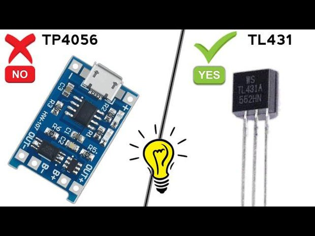 

> **Step 1: Get Your PCB Ready!**

**Talking about electronics.**

 

 

> After making the circuit diagram I transformed it into a PCB design to
> produce it, to produce the PCB, I have chosen the best PCB supplier
> and the cheapest PCB provider to order my circuit. with thereliable
> platform, all I need to do is some simple steps which we will talk
> later.
>
> Related Download Files\
> **As you can see in the pictures above the PCB is very well
> manufactured and I've got the same PCB assembled with all the
> components that we want to use for our main board and all the labels
> and logos are there to guide me during the soldering steps. You can
> also download the Gerber  le for this circuit from the download link
> below in case you want to place an order for the same circuit
> design.**

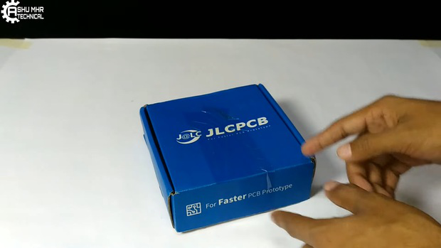 
 

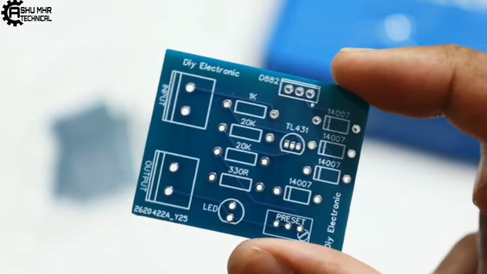 
 

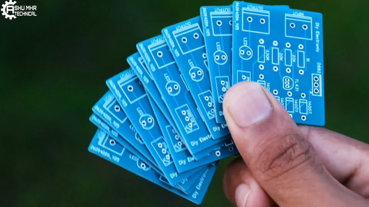 
 

**Step 2: Place All the Components on PCB and Solder It Properly.**

>  
> **Soldering all** the components to
> **PCB PCB**.

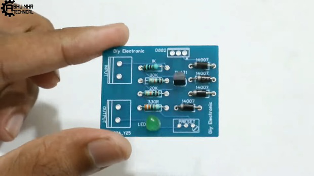 
 

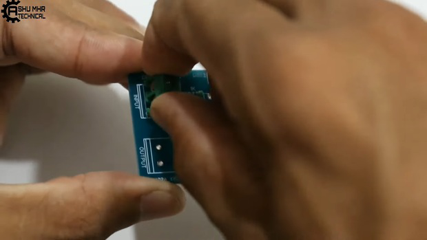 
 

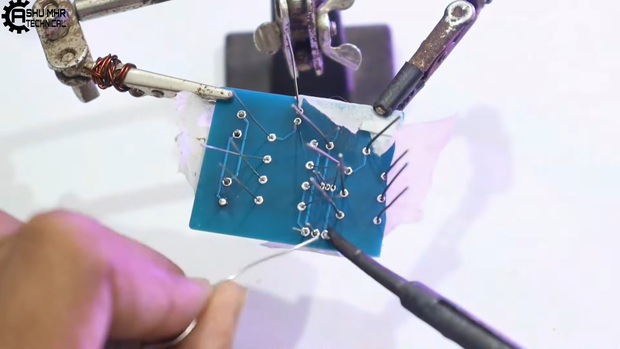 
 

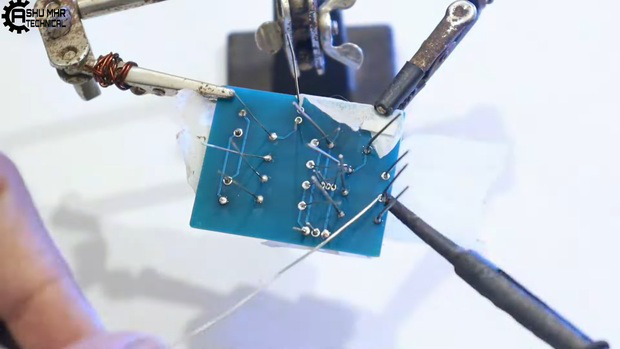 
 

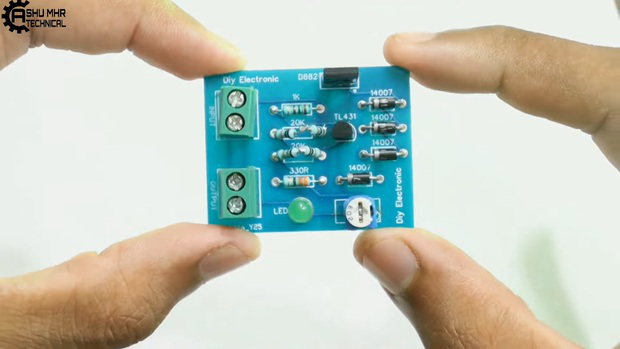 
 

**Step 3: Connecting Remaining Wires**

 

> Connect battery wire to the pcb as shown.\
> Connect power input wires to the pcb.\
> Checking the battery voltage.

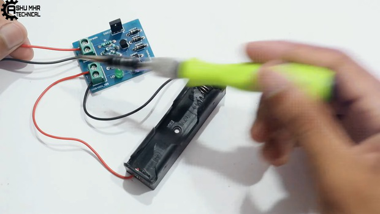 
 

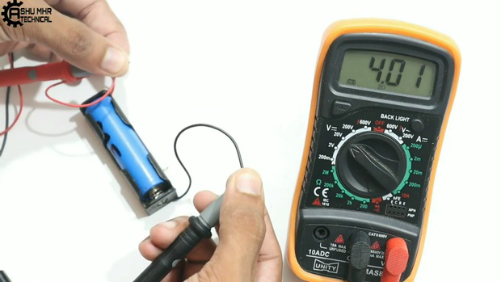 
 

**Step 4: Doing Some Settings**

>  
> Now rotate the preset of the pcb to 4.2v
> as shown in images.

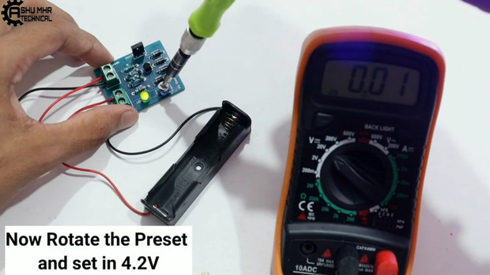 
 

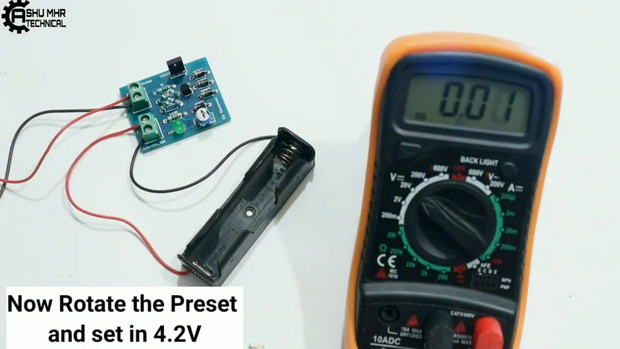 
 

**Step 5: Testing**

 

> Checking the battery voltage before charging(3.9v).
>
> Connect the battery to the circuit then the green light will turn o  ,
> showing that the battery is charging.
>
> \[30 mins later\], green light is turned on indicating that battery is
> fully charged(4.2v) & the charger auto
> cut-off the charging.
>
> **Verifying** the charged battery by measuring the voltage using
> multimeter. **Download Gerber**  file from **HERE. HERE.**
>
> **New users will also get some coupons while registering atvia this
> blue link.**
>
> **Thank you for reading this guide, hopefully**, **this guide provides
> full steps to help you to create your own DIY this guide provides full
> steps to help you to create your own DIY**

**3.7v Battery charger. If you have any questions please post them in
the comment section below.**

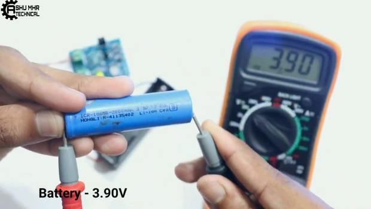 
 

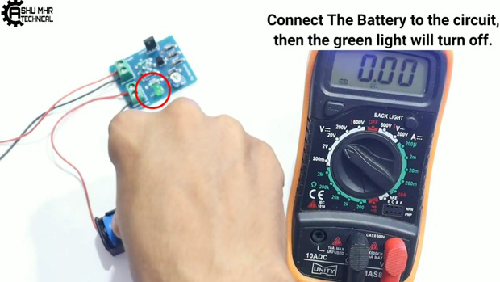 
 

 
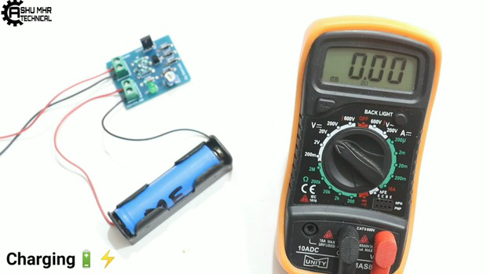 
 

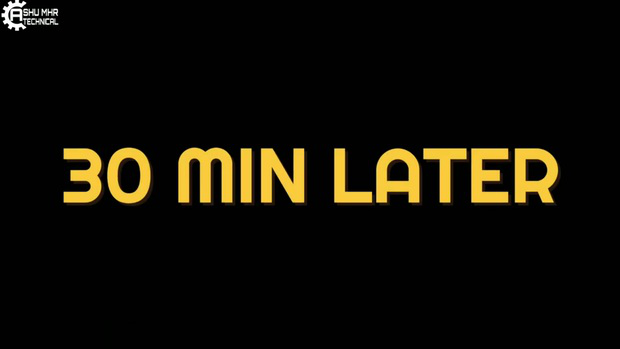 
 

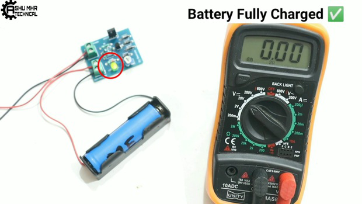 
