{width="0.5236111111111111in"
height="0.5847211286089239in"}

**instructables**

{width="0.5097222222222222in"
height="0.5097211286089239in"}

> by

Batteries are an important part of any battery-operated project or
product. Rechargeable batteries are expensive because they require a
separate charger, but they\'re worth the investment because they last
longer and cost less over time than regular disposable batteries. They
come in several di�erent varieties based on their electrode materials
and electrolytes---lead-acid, nickel cadmium (NiCd), nickel metal
hydride (NiMH), lithium ion (Li-ion), and lithium ion polymer (Li-ion
polymer).

> Here is the step by step process for making your own DIY 3.7v Battery
> Charger.

**Supplies:**

> {width="0.1388888888888889in"
> height="0.1388888888888889in"}Get all the components ready.

DIY 3.7v Battery Charger: Page 1

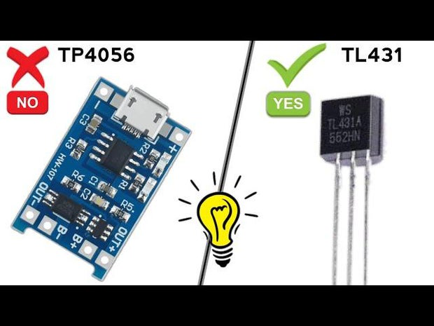{width="7.477777777777778in"
height="5.608333333333333in"}

> **Step 1: Get Your PCB Ready!**

**Talking about electronics.**

{width="0.1388888888888889in"
height="0.1388888888888889in"}

{width="0.1388888888888889in"
height="0.3611111111111111in"}

> After making the circuit diagram I transformed it into a PCB design to
> produce it, to produce the PCB, I have chosen the best PCB supplier
> and the cheapest PCB provider to order my circuit. with thereliable
> platform, all I need to do is some simple steps which we will talk
> later.
>
> Related Download Files\
> **As you can see in the pictures above the PCB is very well
> manufactured and I've got the same PCB assembled with all the
> components that we want to use for our main board and all the labels
> and logos are there to guide me during the soldering steps. You can
> also download the Gerber �le for this circuit from the download link
> below in case you want to place an order for the same circuit
> design.**

DIY 3.7v Battery Charger: Page 2

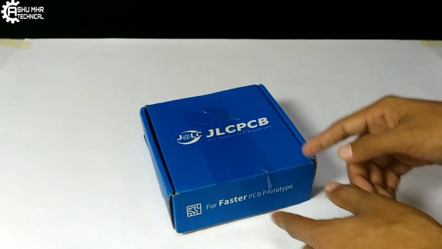{width="7.477777777777778in"
height="4.208333333333333in"}

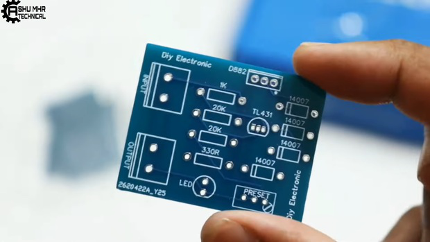{width="7.477777777777778in"
height="4.208333333333333in"}

DIY 3.7v Battery Charger: Page 3

{width="7.477777777777778in"
height="4.208333333333333in"}

**Step 2: Place All the Components on PCB and Solder It Properly.**

> {width="0.1388888888888889in"
> height="0.1527777777777778in"}**Soldering all** the components to
> **PCB PCB**.

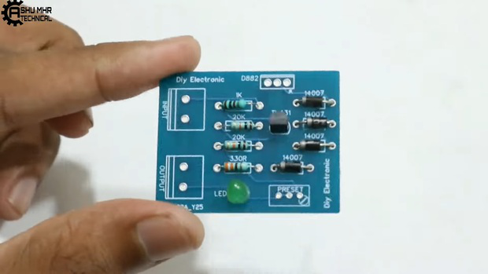{width="7.477777777777778in"
height="4.208333333333333in"}

DIY 3.7v Battery Charger: Page 4

{width="7.477777777777778in"
height="4.208333333333333in"}

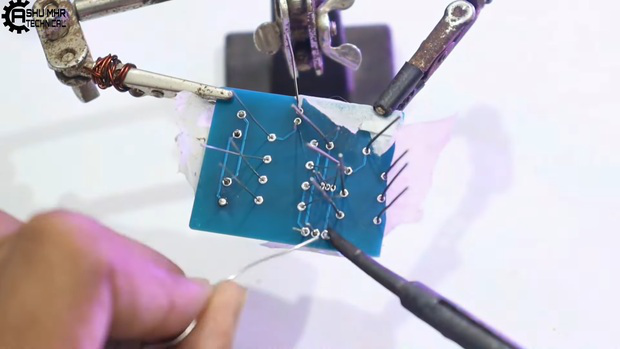{width="7.477777777777778in"
height="4.208333333333333in"}

DIY 3.7v Battery Charger: Page 5

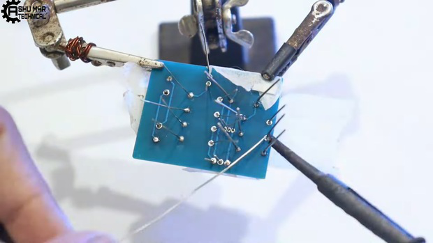{width="7.477777777777778in"
height="4.208333333333333in"}

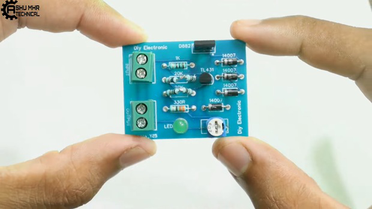{width="7.477777777777778in"
height="4.208333333333333in"}

**Step 3: Connecting Remaining Wires**

{width="0.1388888888888889in"
height="0.1388888888888889in"}

> Connect battery wire to the pcb as shown.\
> Connect power input wires to the pcb.\
> Checking the battery voltage.

DIY 3.7v Battery Charger: Page 6

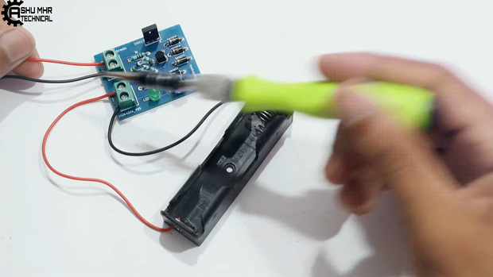{width="7.477777777777778in"
height="4.208333333333333in"}

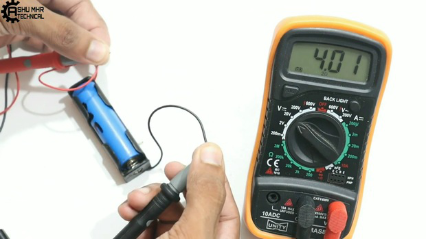{width="7.477777777777778in"
height="4.208333333333333in"}

**Step 4: Doing Some Settings**

> {width="0.1388888888888889in"
> height="0.1527777777777778in"}Now rotate the preset of the pcb to 4.2v
> as shown in images.

DIY 3.7v Battery Charger: Page 7

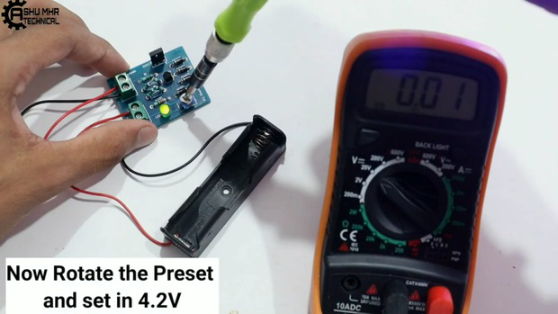{width="7.477777777777778in"
height="4.208333333333333in"}

{width="7.477777777777778in"
height="4.208333333333333in"}

**Step 5: Testing**

{width="0.1388888888888889in"
height="0.1388888888888889in"}

> Checking the battery voltage before charging(3.9v).
>
> Connect the battery to the circuit then the green light will turn o� ,
> showing that the battery is charging.
>
> \[30 mins later\], green light is turned on indicating that battery is
> fully charged(4.2v) & the charger auto

DIY 3.7v Battery Charger: Page 8

{width="0.1388888888888889in"
height="0.1527777777777778in"}

> cut-o� the charging.
>
> **Verifying** the charged battery by measuring the voltage using
> multimeter. **Download Gerber** �le from **HERE. HERE.**
>
> **New users will also get some coupons while registering atvia this
> blue link.**
>
> **Thank you for reading this guide, hopefully**, **this guide provides
> full steps to help you to create your own DIY this guide provides full
> steps to help you to create your own DIY**

**3.7v Battery charger. If you have any questions please post them in
the comment section below.**

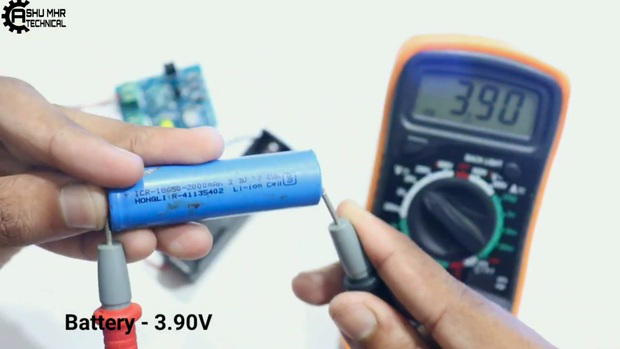{width="7.477777777777778in"
height="4.208333333333333in"}

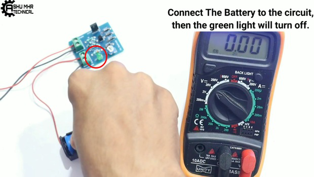{width="7.477777777777778in"
height="4.208333333333333in"}

DIY 3.7v Battery Charger: Page 9

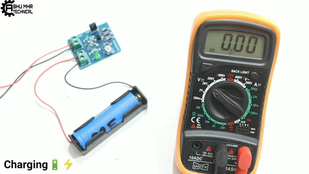{width="7.477777777777778in"
height="4.208333333333333in"}

{width="7.477777777777778in"
height="4.208333333333333in"}

DIY 3.7v Battery Charger: Page 10

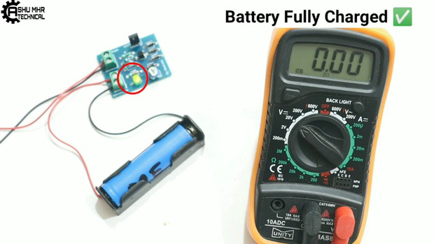{width="7.477777777777778in"
height="4.208333333333333in"}

DIY 3.7v Battery Charger: Page 11
